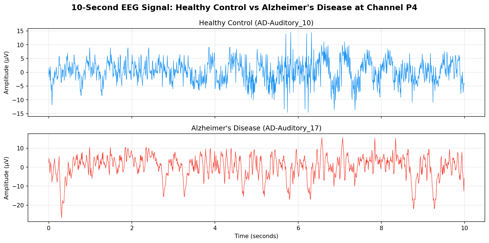
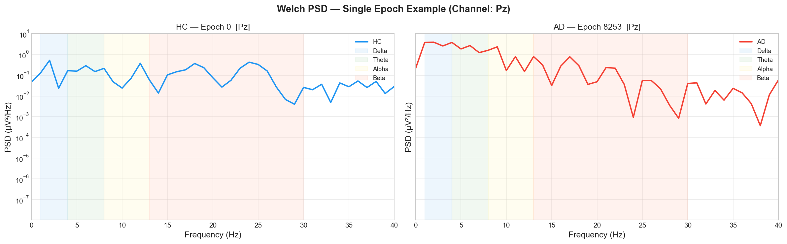
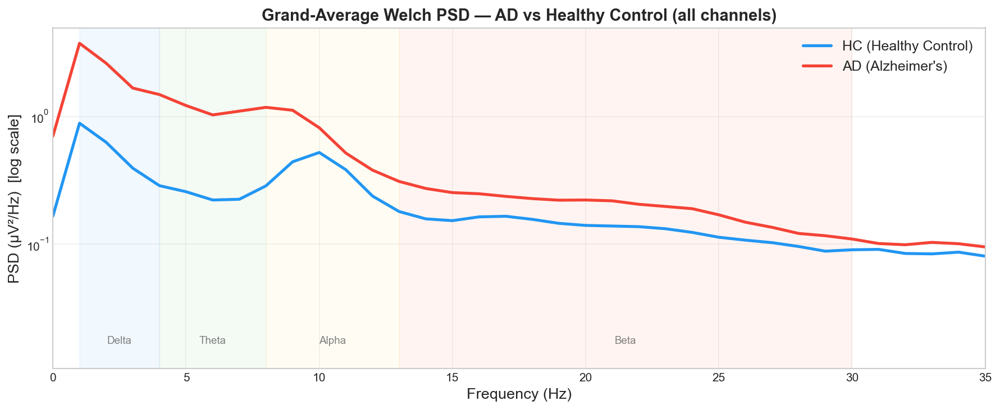
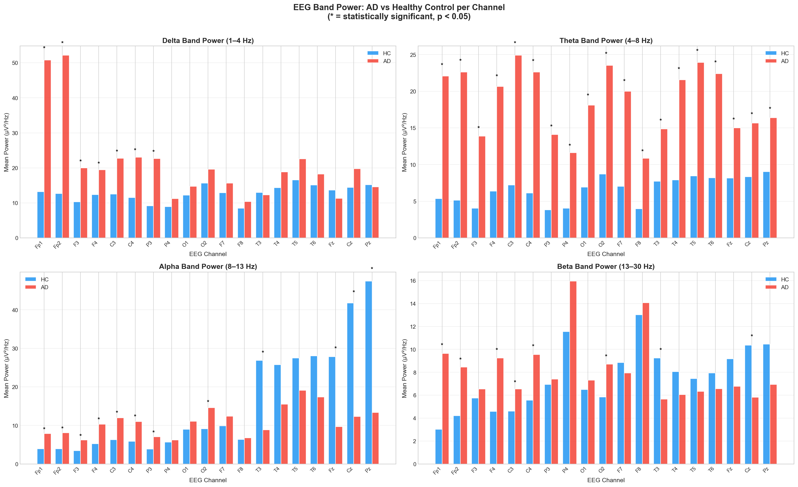
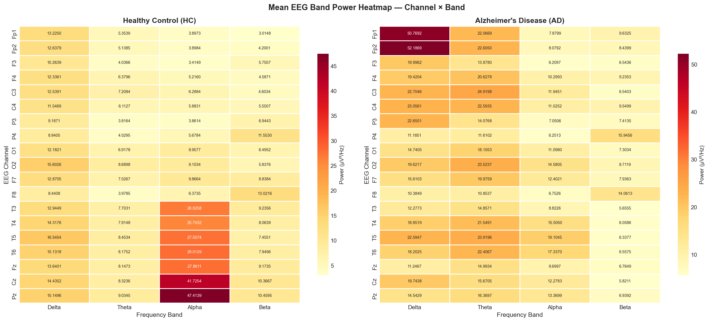
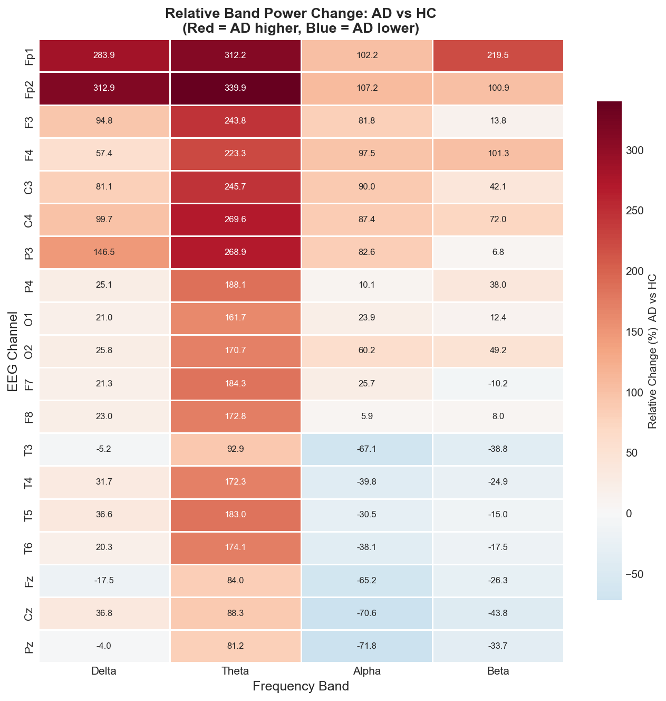
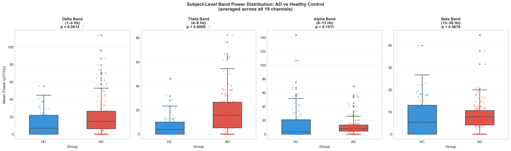

# Midterm Project Proposal / Requirements Document

## EEG-Based Alzheimer's Disease Detection

**CS 4485 Capstone Project**  
**Team:** Venkatasai Gudisa, Ajay Alluri, Ethan Varghese, Aashay Vishwakarma, Venkat Sai Eshwar Varma Sagi, Ram Gudur  
**Repository:** [CS4485-eeg-alzheimers-detection](https://github.com/Pakkuu/CS4485-eeg-alzheimers-detection)

---

## 1. Executive Summary and Project Objectives

### 1.1 Summary

This capstone project aims to develop a lightweight machine learning system for detecting Alzheimer's Disease (AD) from electroencephalogram (EEG) signals. We use the Largest Alzheimer EEG Dataset from Kaggle to extract frequency-domain features, compare AD and Healthy Control (HC) subjects statistically, and build a deployable classification model. The work integrates neuroscience fundamentals, signal processing, and machine learning to support research on non-invasive AD biomarkers.

### 1.2 Project Objectives (Professor-Assigned)

1. **Learn the fundamentals of Alzheimer's disease** including how it affects brain structure
2. **Understand EEG as a brain monitoring tool**
3. **Analyze changes in brain activity** between AD and healthy subjects
4. **Develop a lightweight machine learning model** for AD detection
5. **Evaluate system performance** using appropriate metrics and validation strategies

---

## 2. Task 1 Results — Understanding the Raw EEG Signal

### 2.1 Dataset Description

We use the [Largest Alzheimer EEG Dataset](https://www.kaggle.com/datasets/codingyodha/largest-alzheimer-eeg-dataset) from Kaggle, an integrated collection of EEG recordings standardized for Alzheimer's research.

### 2.2 Dataset Statistics

| Metric | Value |
|--------|-------|
| Total number of subjects | 241 |
| Healthy Controls (HC) | 78 |
| Alzheimer's Disease (AD) | 122 |
| Frontotemporal Dementia (FTD) | 41 |
| Number of EEG channels | 19 |
| Sampling rate | 128 Hz |
| Recording duration | 101,916 seconds (~28.3 hours total) |
| Average duration per subject | ~423 seconds |
| Shape of data matrix (per epoch) | 19 Channels × 128 Time samples |

**Labels:** `0.0` = Healthy Control (HC), `1.0` = Alzheimer's Disease (AD), `2.0` = Frontotemporal Dementia (FTD)

**Note:** Class imbalance exists (78 HC vs 122 AD). This will be addressed in modeling via oversampling, class weights, or stratified sampling.

### 2.3 10-Second EEG Plot

We selected one Healthy Control subject and one Alzheimer's Disease subject, using the same posterior channel (P4) for both:

- **HC subject:** AD-Auditory_10  
- **AD subject:** AD-Auditory_17  
- **Channel:** P4 (posterior parietal, 10-20 system)

A 10-second segment of EEG signal was plotted for both subjects with Time on the x-axis and Amplitude on the y-axis. The plot represents electrical brain activity from one cortical region over time. Visual analysis showed differences in signal characteristics consistent with known AD EEG biomarkers (e.g., slowing, increased variability).

*Figure: 10-second EEG signal from channel P4 — Healthy Control (AD-Auditory_10) vs Alzheimer's Disease (AD-Auditory_17). Time on x-axis, Amplitude (µV) on y-axis.*

---

## 3. Task 2 Results — Frequency Analysis and Band Power

### 3.1 Methodology

**Power Spectral Density (PSD):** We compute PSD using the **Welch method** via `scipy.signal.welch`:

1. Splits the signal into overlapping segments (50% overlap)
2. Applies a Hann window to each segment
3. Computes the Fast Fourier Transform (FFT) of each windowed segment
4. Averages power across segments to produce a stable spectral estimate

**Parameters:** 1-second Hann window, 50% overlap, 1 Hz frequency resolution.

**Frequency Bands:** Average power was computed within:

| Band | Range |
|------|-------|
| Delta | 1–4 Hz |
| Theta | 4–8 Hz |
| Alpha | 8–13 Hz |
| Beta | 13–30 Hz |

**Feature aggregation:** Per-epoch band powers were averaged across all epochs per subject to produce stable per-subject, per-channel, per-band features.

*Figure 1: Welch PSD for one HC and one AD epoch at channel Pz — pipeline sanity check.*

*Figure 2: Grand-average PSD across all channels comparing AD vs Healthy Control.*

### 3.2 Band Power Table (Sample Channels)

Mean band power (µV²/Hz) for AD vs HC at selected channels:

| Channel | Delta (AD) | Delta (HC) | Theta (AD) | Theta (HC) | Alpha (AD) | Alpha (HC) | Beta (AD) | Beta (HC) |
|---------|------------|------------|------------|------------|------------|------------|-----------|-----------|
| Fp1 | 50.77 | 13.22 | 22.07 | 5.35 | 7.88 | 3.90 | 9.63 | 3.01 |
| Fp2 | 52.19 | 12.64 | 22.61 | 5.14 | 8.08 | 3.90 | 8.44 | 4.20 |
| P3 | 22.65 | 9.19 | 14.08 | 3.82 | 7.05 | 3.86 | 7.41 | 6.94 |
| P4 | 11.19 | 8.94 | 11.61 | 4.03 | 6.25 | 5.68 | 15.95 | 11.55 |
| Fz | 11.25 | 13.64 | 15.00 | 8.15 | 9.70 | 27.86 | 6.76 | 9.17 |
| Cz | 19.74 | 14.44 | 15.67 | 8.32 | 12.28 | 41.73 | 5.82 | 10.37 |
| Pz | 14.54 | 15.15 | 16.37 | 9.03 | 13.37 | 47.41 | 6.94 | 10.46 |

### 3.3 Observations: Delta, Theta, and Alpha Power in AD vs HC

**Delta (1–4 Hz):** Elevated in AD at frontal (Fp1, Fp2), central (C3, C4), and parietal (P3) channels. Midline and posterior channels (Fz, Pz) show no significant difference or slight HC elevation.

**Theta (4–8 Hz):** Consistently elevated in AD across almost all channels. Strongest effects at frontal (Fp1, Fp2), central (C3, C4), parietal (P3, P4), and temporal (T3–T6) regions. This is one of the most robust discriminative bands.

**Alpha (8–13 Hz):** Reduced in AD at midline channels (Fz, Cz, Pz) and temporal channels (T3). At frontal and central regions (Fp1–F4, C3, C4), Alpha is actually higher in AD in some cases. The posterior/midline Alpha reduction aligns with known AD EEG biomarkers (posterior dominant rhythm slowing).

**Summary:** Our findings align with established AD EEG literature: increased Delta and Theta (slowing), and reduced Alpha at posterior/midline regions. These band power differences provide a strong feature set for machine learning classification.

*Figure 3: Mean band power per channel (HC vs AD) with significance markers.*

*Figure 4: Heatmap of mean band power by channel and group.*

*Figure 5: Relative (%) band power difference: (AD − HC) / HC.*

---

## 4. Task 3 Results — Statistical Comparison Between Groups

### 4.1 Subject-Level Band Power

We computed mean band power per subject by averaging across all 19 channels. Each subject has one representative value per band (Delta, Theta, Alpha, Beta). The resulting table is stored in `eeg_band_analysis_csv/eeg_band_power_subject_level.csv`.

### 4.2 Boxplots

We generated boxplots comparing AD vs HC for:

- **Alpha power** (AD vs Control)
- **Theta power** (AD vs Control)
- **Delta power** (AD vs Control)
- **Beta power** (AD vs Control)

*Figure 6: Box plots of subject-level band power per group per band (AD vs HC).*

### 4.3 Statistical Testing

We performed **Welch's independent-samples t-test** (unequal variances) at each channel × band combination to compare AD vs HC. Results are in `eeg_band_analysis_csv/eeg_band_power_stats.csv`.

**Findings:**

- **Theta:** Statistically significant (p < 0.05) at all 19 channels. Consistently elevated in AD.
- **Delta:** Significant at frontal (Fp1, Fp2), central (C3, C4), parietal (P3), and several other channels. Not significant at P4, O1, O2, F7, F8, T3, T4, T5, T6, Fz, Pz.
- **Alpha:** Significant reduction in AD at midline (Fz, Cz, Pz) and temporal (T3). Significant increase in AD at frontal (Fp1, Fp2, F3, F4) and central (C3, C4, O2).
- **Beta:** Mixed; significant at frontal and central channels (AD higher), and at Cz (AD lower).

The statistical results support the use of band power features for AD vs HC classification.

---

## 5. Future Work — ML Training Roadmap (Rest of Semester)

### 5.1 Data Pipeline (Already in Place)

- **Preprocessing:** Bandpass filtering and artifact rejection (Ethan Varghese)
- **Epoching:** Signal segmented into fixed 1-second windows
- **Feature extraction:** Welch PSD → band power (Delta, Theta, Alpha, Beta) per channel

### 5.2 Feature Set

- **Primary:** Per-channel band powers → 19 channels × 4 bands = **76 features**
- **Optional:** Connectivity measures, entropy, or other qEEG features for model improvement

### 5.3 Model Strategy (Lightweight)

- **Baseline models:** Logistic Regression, Random Forest, XGBoost
- **Optional:** Shallow neural network or 1D CNN if compute allows
- **Focus:** Interpretability, deployability, and low computational cost (lightweight)

### 5.4 Evaluation

- **Metrics:** Accuracy, AUC-ROC, Sensitivity, Specificity
- **Validation:** Subject-level stratified k-fold cross-validation (avoid epoch-level data leakage)
- **Benchmarking:** Compare against literature (Ram Gudur's compiled references)

### 5.5 Timeline (Rest of Semester)

| Phase | Weeks | Activities |
|-------|-------|------------|
| Baseline | 1–2 | Train baseline models, hyperparameter tuning |
| Comparison | 3–4 | Feature selection, model comparison |
| Finalization | 5–6 | Final model selection, evaluation, documentation |
| Optional | As needed | Validate on OpenNeuro ds004504 once pipeline is stable |

---

## 6. Project Management

### 6.1 Communication Plan

- **Tools:** Microsoft Teams, GitHub, Google Colab
- **Cadence:** Weekly team meetings; async updates via repository commits and Teams chat
- **Documentation:** Shared README, notebooks, and this proposal; all code in GitHub
- **Meeting link:** [Teams](https://teams.microsoft.com/meet/27114829884284?p=PAiYn6TWeg0HQTxtNM)

### 6.2 Risk Analysis

| Risk | Mitigation |
|------|------------|
| Class imbalance (78 HC vs 122 AD) | Oversampling, class weights, or stratified sampling in training |
| Data quality / artifact contamination | Preprocessing checks; artifact rejection already implemented |
| Limited journal access | Use open-access sources; Ram's glossary and reference doc |
| Learning curve on EEG/neuroscience | Shared glossary, cheat sheet, and literature summaries |
| Subject-level data leakage | Strict subject-level train/test splits; no epoch-level leakage |

### 6.3 Progress Tracking Plan

- **Weekly reports:** Submitted per professor requirements
- **GitHub:** Issues and milestones for task tracking
- **Key deadlines:** Midterm proposal (this document), final deliverable

### 6.4 Project Performance Metrics

**Technical metrics:**
- Model accuracy, AUC-ROC, sensitivity, specificity
- Feature importance and interpretability

**Process metrics:**
- Task completion rate
- Meeting attendance and participation
- Documentation currency and code quality

---

## 7. Ethics and Leadership

### 7.1 Ethical Aspects

- **Data use:** We use a public, pre-anonymized EEG dataset. No new human subjects are recruited.
- **Privacy:** The Kaggle dataset is de-identified; we do not handle identifiable health information.
- **Responsible AI:** The model is for research and education only. It is not intended for clinical diagnosis. Any future deployment would require regulatory and clinical validation.
- **Bias and fairness:** We acknowledge class imbalance and demographic limitations of the dataset. We will report these limitations in our final documentation.

### 7.2 Team Roles

| Member | Primary Role |
|--------|--------------|
| Venkatasai Gudisa | Signal visualization, EEG plots, frequency band analysis |
| Ajay Alluri | Dataset statistics, data quality, class distribution analysis |
| Ethan Varghese | Repository setup, preprocessing, bandpass filter, artifact rejection, epoched data |
| Aashay Vishwakarma | Feature extraction, PSD/band power pipeline |
| Venkat Sai Eshwar Varma Sagi | Analysis, AD biomarker linkage, visualization |
| Ram Gudur | Literature review, qEEG biomarkers, ML approaches, evaluation metrics |

### 7.3 Leadership Aspects for Peer Review

- **Shared leadership:** Task leads rotate by deliverable; each member owns specific components
- **Peer feedback:** Regular review of contributions and collaboration during meetings
- **Decision-making:** Consensus on major choices; escalation to professor if needed
- **Conflict resolution:** Open discussion; majority vote if necessary

---

## 8. References and Appendix

### 8.1 Datasets

- **Primary:** [Largest Alzheimer EEG Dataset](https://www.kaggle.com/datasets/codingyodha/largest-alzheimer-eeg-dataset) (Kaggle)
- **Optional:** OpenNeuro ds004504 (88 subjects: 36 AD, 23 FTD, 29 HC; BIDS format)

### 8.2 Repository

- [CS4485-eeg-alzheimers-detection](https://github.com/Pakkuu/CS4485-eeg-alzheimers-detection)

### 8.3 Figure Placement Reference

| Figure File | Section | Purpose |
|-------------|---------|---------|
| `eeg_10s_hc_vs_ad_p4.png` (if saved) | 2.3 Task 1 — 10-Second EEG Plot | Raw EEG: HC vs AD at channel P4 |
| `psd_single_epoch_example.png` | 3.1 Task 2 — Methodology | Welch PSD pipeline example |
| `grand_avg_psd_ad_vs_hc.png` | 3.1 Task 2 — Methodology | Grand-average PSD comparison |
| `band_power_bar_all_channels.png` | 3.3 Task 2 — Observations | Bar chart with significance markers |
| `band_power_heatmap.png` | 3.3 Task 2 — Observations | Mean band power by channel/group |
| `band_power_relative_diff_heatmap.png` | 3.3 Task 2 — Observations | Relative (AD−HC)/HC difference |
| `band_power_boxplot_subjects.png` | 4.2 Task 3 — Boxplots | Alpha/Theta/Delta/Beta boxplots (AD vs HC) |

### 8.4 Key Project Files

| File | Description |
|------|-------------|
| `eeg_dataset_statistics.ipynb` | Dataset statistics and summary |
| `eeg_frequency_band_analysis.ipynb` | Welch PSD, band power extraction, statistical comparison |
| `explore_alzheimer_eeg_dataset.ipynb` | Interactive EEG exploration |
| `eeg_band_analysis_csv/eeg_band_power_stats.csv` | T-test results per channel × band |
| `eeg_band_analysis_csv/eeg_band_power_subject_level.csv` | Subject-level band power features |

### 8.5 Literature

Key papers and references compiled by Ram Gudur during the literature review phase support our methodology and will be cited in the final report.
